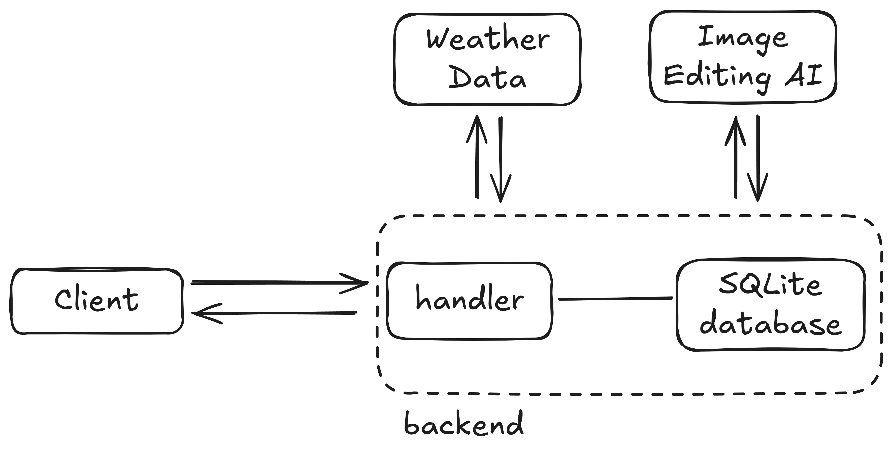

# SkyWeave

Transform your landscape photos to match weather conditions from any date - past or future.

## The Problem

Travel plans get ruined by unexpected weather. A lifetime isn't long enough to see every dream destination in every condition you imagine. You can find photos online, but never of your exact spot in your ideal weather. What if you simply want to see the Eiffel Tower in the rain, or your favorite beach at sunset during a storm?

The fundamental challenge is that experiencing the world requires three scarce resources: time, money, and physical ability. Even when you have all three, weather remains unpredictable. This creates a gap between the places we want to experience and the conditions we hope to see them in.

## Our Solution

SkyWeave bridges this gap by combining real meteorological data with AI image transformation. Upload any landscape photo, select a location and date, and the system retrieves authentic historical weather data or forecasts, then transforms your image to match those exact conditions. The result is a photorealistic visualization of your scene in the weather you've always imagined.

This matters for people stuck indoors who need mental respite, for busy professionals who can't take time to travel, for those on tight budgets who want to visualize expensive trips before committing, and for anyone with mobility challenges who wants to experience places they can't physically visit. It's also a powerful creative tool for artists and designers, and sometimes it's just about satisfying pure curiosity about how a place would look in different conditions.

## Features

The system supports location-based weather data from any city, zip code, or coordinates. Users can access historical weather from the past year or forecasts up to 16 days ahead. Time of day control allows transformation of lighting from dawn to dusk. The AI-powered transformation uses Replicate's flux-kontext-pro model for photorealistic results. Simple passphrase protection enables private deployment, and the responsive design works seamlessly on all devices.

## Tech Stack

**Backend**

- Go 1.25+ (standard library HTTP server)
- SQLite (modernc.org/sqlite - pure Go, no CGO)
- OpenWeather API (Geocoding, History, and Forecast APIs)
- Replicate API (black-forest-labs/flux-kontext-pro)

**Frontend**

- HTML templates with Tailwind CSS
- HTMX for real-time status updates
- Minimal vanilla JavaScript for client-side features

**Architecture**

- Async processing with goroutines
- Database-backed session management
- Automatic schema migration
- Background task scheduling



## Quick Start

### Prerequisites

- Go 1.25 or higher
- OpenWeather API key ([get one free](https://openweathermap.org/api))
- Replicate API token ([sign up here](https://replicate.com))

### Local Development

1. **Clone the repository**

```bash
git clone https://github.com/changsun20/skyweave.git
cd skyweave
```

2. **Set environment variables**

```bash
# Create a .env file or export directly
export OPENWEATHER_API_KEY="your-openweather-key"
export REPLICATE_API_TOKEN="your-replicate-token"
export ACCESS_PASSPHRASE="your-secret-passphrase"  # Optional for local dev
export PORT="4000"  # Optional, defaults to 4000
```

3. **Run the application**

```bash
go run .
```

4. **Open your browser**

```
http://localhost:4000
```

## Deployment

### Railway Deployment

1. **Fork this repository** to your GitHub account

2. **Connect to Railway**

   - Sign up at [railway.app](https://railway.app)
   - Create new project from GitHub repo
   - Select your forked repository

3. **Configure environment variables** in Railway dashboard:

   ```
   OPENWEATHER_API_KEY=your-key
   REPLICATE_API_TOKEN=your-token
   ACCESS_PASSPHRASE=your-strong-passphrase
   PORT=4000
   ```

4. **Add persistent volume**

   - Mount point: `/app/data`
   - This stores the SQLite database and uploaded images

5. **Deploy**
   - Railway will automatically build and deploy
   - Your app will be live at `https://your-app.railway.app`

### Other Platforms

The application works on any platform that supports Go 1.25+:

- Heroku (with buildpacks)
- Render
- Google Cloud Run
- AWS Elastic Beanstalk
- DigitalOcean App Platform

**Requirements:**

- Persistent volume mounted at `/app/data`
- Environment variables configured
- Port binding from `$PORT` environment variable

## How It Works

The user journey starts with uploading a landscape photo and selecting a location, target date, and optional time of day. The system then retrieves real weather data from OpenWeather's API and displays it for user confirmation. Once confirmed, the photo is uploaded to Replicate along with a detailed AI prompt generated from the weather data. The system polls for completion every 5 seconds, and when ready, the transformed image is downloaded and presented to the user.

### Technical Flow

```
Submit Form → Save to DB → Async Weather Fetch
                ↓
          Weather Ready → Show Confirmation
                ↓
          User Confirms → Upload to Replicate
                ↓
          Create Prediction → Poll Status (5s intervals)
                ↓
          Download Result → Mark Complete
```

The data pipeline handles geocoding to convert location input into coordinates, retrieves historical data from OpenWeather's History API for dates in the past year or forecast data from the Daily Forecast 16 Days API for future dates, generates detailed AI prompts that combine weather parameters, and sends everything to Replicate for asynchronous processing.## Authentication

For private deployments, SkyWeave includes simple passphrase protection. Set the `ACCESS_PASSPHRASE` environment variable, and users must enter this passphrase to access the app. Sessions last 24 hours and are stored in the database, surviving server restarts.

## API Usage & Costs

OpenWeather offers a generous free tier, which should be sufficient for personal use and this translates to approximately zero cost. Replicate charges around $0.04 per image transformation using the black-forest-labs/flux-kontext-pro model, with processing times between 4-10 seconds per image (and you can always change other models if desired). A strong passphrase helps prevent unauthorized API usage.

## Database Schema

The system uses two tables: `requests` stores all image transformation requests along with weather data and status tracking, while `sessions` manages user authentication with automatic 24-hour expiration. Auto-migration handles schema changes automatically when you restart the app with updated code.

## Project Structure

```
skyweave/
├── main.go              # Application entry point, routing
├── auth.go              # Authentication middleware
├── database.go          # SQLite operations, schema
├── handlers.go          # HTTP request handlers
├── weather.go           # OpenWeather API client
├── replicate.go         # Replicate API integration
├── utils.go             # Helper functions
├── templates/           # HTML templates with Tailwind CSS
│   ├── home.html
│   ├── login.html
│   ├── start.html
│   ├── confirm.html
│   ├── processing.html
│   └── status.html
└── data/                # SQLite DB and uploaded images (gitignored)
```

## Contributing

Contributions are welcome!

Areas for improvement:

- Additional weather APIs (more historical data)
- Batch processing multiple images
- Social sharing features
- More AI models for different artistic styles
- Progressive Web App (PWA) support

## License

MIT License - feel free to use this project however you'd like.

## Acknowledgments

- OpenWeather for comprehensive weather data APIs
- Replicate for making cutting-edge AI models accessible
- black-forest-labs for the incredible flux-kontext-pro model
- The Go community for excellent standard and third party libraries

---

Built for creative exploration and weather curiosity.
